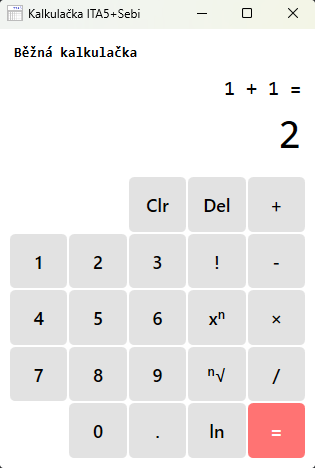

# SmolCalc

Kalkulačka v WFP .NET 8.0

Instalace
---------

1. Stáhněte si instalační soubor:
    - Z Releases v GitHubu
    - Sestavením instalačního projektu ve Visual Studio (right click + Build)

2. Spustťe instalační soubor *.msi a projděte průvodcem instalace

U stddev se automaticky nenastaví proměná `PATH`, je nutné ji případně nastavit manuálně

Prostředí
---------

Windows 64bit

Autoři
------

ITA5 + Sebi
- xkrivat00 Tomáš Křivan
- xhavlap00 Petr Havlát
- xkurtil00 Lukáš Kurtin 
- xkunseb00 Sebastian Jesse Kun 

Licence
-------

Tento program je poskytován pod licencí GNU GPLv3